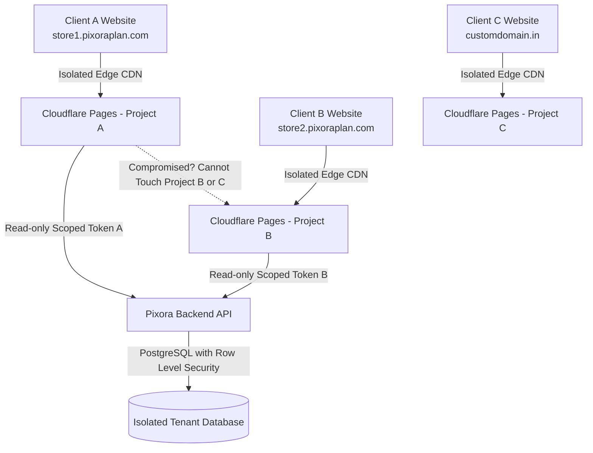

# PixoraPlan - Website Subscription Platform Plan (₹299/month)

## Goal Description
Build **PixoraPlan**, an automated "Website-as-a-Service" (WaaS) platform for Indian businesses and creators offering ready-to-use professional websites at **₹299/month**. The platform includes:
- **Recurring auto-debit** via **Razorpay Subscriptions (UPI AutoPay / eMandate)**.
- **Zero-cost, fast commercial hosting** via Cloudflare Pages / Vercel.
- **Free subdomain** (`clientname.pixoraplan.com`) with the ability for customers to map their own custom domain.
- **Strict Site-to-Site Security Isolation**: If any single client's website or admin account is compromised, **zero other websites, customer data, or backend databases can be affected**.

---

## Security & Total Tenant Isolation Architecture

> [!IMPORTANT]
> **Why WordPress/Shared Hosting Fails**: Traditional shared hosting (cPanel/shared PHP) allows attackers to hop from one directory or database to another if one site is compromised (Symlink / Local File Inclusion exploits).
> **PixoraPlan's Zero-Trust Isolation Model**:
> 1. **Isolated Static / Jamstack Deployments**: Each client website is built and compiled into independent static assets hosted on **Cloudflare Pages / Edge CDN**. There is **no shared PHP runtime or server process** running that can be compromised or exploited across tenants.
> 2. **Separate Sandboxed Edge Repositories / Buckets**: Every client's website code and asset files live in their own isolated deployment container or Git branch / R2 bucket.
> 3. **Row-Level Security (RLS) & Sandboxed Database**: Client data (orders, inquiries, catalog) is isolated with cryptographic Row-Level Security (RLS) in Supabase/PostgreSQL. Site A’s API key can NEVER query Site B’s data.
> 4. **API Token Scoping**: Each client site receives a scoped public read-only API key strictly limited to its own UUID (`site_id`). No write operations or cross-site reads are possible from client-side code.
> 5. **Cloudflare WAF & DDoS Protection**: Free global DDoS protection, SSL auto-renewal, and bot fight mode enabled per domain.

---

## Proposed System Modules

### 1. Main Platform Landing & Sales Funnel (`pixoraplan-portal`)
- **Aesthetic**: Premium dark mode with gradient neon accents, glassmorphic cards, dynamic pricing toggle, and interactive template previews.
- **Value Proposition**: 
  - "Launch your business website at ₹299/mo"
  - Free hosting, Free SSL, Free Subdomain
  - WhatsApp direct ordering for e-commerce
  - UPI AutoPay convenience (no manual monthly transfers)
  - Bank-grade isolation & security
- **Live Template Switcher**:
  - E-Commerce / Fast Storefront (WhatsApp / UPI direct checkout)
  - Service Business (Salons, Clinics, Consulting, Local Agencies)
  - Portfolio / Creator

### 2. Customer Onboarding & Checkout Wizard
- **Step 1: Business Details**: Business name, category, phone number, city, logo upload.
- **Step 2: Template Choice**: E-Commerce, Service, or Portfolio.
- **Step 3: Subdomain Selection**: Real-time availability check for `[yourname].pixoraplan.com`.
- **Step 4: UPI AutoPay Mandate (Razorpay Subscriptions)**:
  - Generates Razorpay Subscription plan (₹299/month recurring).
  - User authorizes via Google Pay / PhonePe / Paytm / BHIM UPI.
  - Razorpay Webhook activates the subscription and notifies the provisioning pipeline.

### 3. Client Self-Service Dashboard
- Manage business info, products, images, contact phone, and operating hours.
- View subscription status, next auto-debit date, and download GST/commercial invoices.
- Step-by-step custom domain mapping guide (CNAME records).

### 4. Admin Command Center (for You to manage 100+ clients)
- Complete client registry (Tenant ID, Domain, Plan Status, MRR).
- One-click site suspension switch (triggered automatically if autopay fails after grace period).
- One-click trigger for redeploying templates.

---

## Tech Stack
- **Frontend & App Framework**: Next.js 14+ (App Router) + Tailwind CSS + Lucide Icons.
- **Payments**: Razorpay Subscriptions SDK (UPI AutoPay, Cards, eMandate) + Webhook listener.
- **Database & Auth**: Supabase / PostgreSQL with strict Row Level Security (RLS).
- **Hosting Strategy**: Cloudflare Pages / Vercel (automated build & preview per tenant).

---

## Verification Plan

### Automated Checks
- `npm run build`: Verify Next.js production build without errors.
- Webhook signature verification tests for Razorpay payment events.

### Manual Verification
- Test interactive onboarding form and subdomain availability checker.
- Verify security rule isolation: test that querying with Tenant A's token cannot retrieve Tenant B's data.
- Test responsive mobile layout and checkout simulation.
